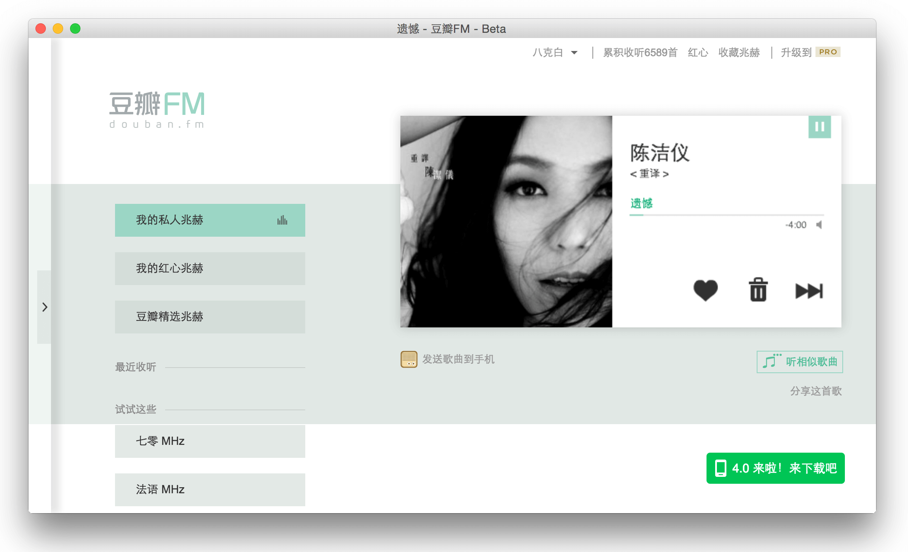

# douban-fm-shell

这个项目缘于 2015 年 11 月，豆瓣把 FM 官方客户端停了，第三方客户端由于使用了官方 API 也不能用了，界面一直显示「客户端已经停止使用，请前往 douban.fm 收听，感谢理解。」，并且单曲循环。

于是乎...

- 我不能没事儿就开个浏览器听歌啊！
- 好怀念桌面版
- 就想静静的听个歌，还要开个浏览器，心好累..
- ... ...

怎么办？很遗憾...本工具并无法从根本上解决上面的问题，只是试图减少那么一丁点的麻烦，也就是 `不必开着网页听音乐`。

> 注：douban-fm-shell 不同于 k.f.storm 等客户端，它只是一个 douban.fm 的壳...

# 下载地址

- Mac 10.7+: [32bit](http://pan.baidu.com/s/1kTwCXxH) / [64bit](http://pan.baidu.com/s/1i38Su9n)
- Windows: [32bit](http://pan.baidu.com/s/1c0hYjT2) / [64bit](http://pan.baidu.com/s/1sjMjn1j)

> PS: windows 版本打开速度可能会有点慢。